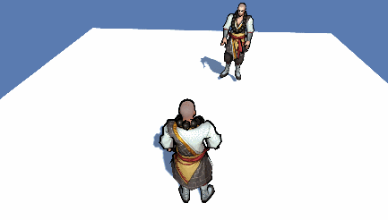

# 剧情文本生成为Timeline的DEMO


受《巫师3》开发团队在[GDC的演讲Dialogue System](https://www.youtube.com/watch?v=chf3REzAjgI)启发，思考在游戏开发中确实可以由策划编写剧情台本，台本中包含角色对话、动作、摄像机机位等描述，由程序可自动生成在Unity中演出的Timeline（并且中间可以接受等待用户输入的操作，比如对话框的确认），故尝试编写此DEMO。

本DEMO仅用作简单的技术测试实现验证，功能为将一段编写好的文本文件转化为可播放的Timeline。并填入动作、对话、摄像机切换等。

比如样例台本GENERATE.txt（位于Assets/TimelineGenerate下）


```
//--------------测试台本--------------

//npc1先行动一次
npc1(Act_Study)

[镜头反打]npc1
npc1:测试我讲话
[镜头特写]npc1
npc1:来吧，一决胜负！
npc1:我的剑不会留情的。

[镜头特写]npc2
npc2(Fxxk):测试一下我的动作

[镜头反打]npc2
npc2(Fxxk):反打镜头测试

[镜头特写]npc1
npc1:镜头测试

[镜头反打]npc2
npc2(Act_Study):臭姿势测试
npc2:结束语
npc2(Fxxk)

```




测试方法

* 可以直接启动场景，即可自动生成timeline并播放。（生成runtime Timeline）
* 亦可使用场景中TimelineGenerator包含的“Generate”功能，直接生成timeline asset（默认输出在TimelineGenerate目录下，generate.asset）

注：

* 摄像机切换使用Cinemachine
* 由于DEMO考虑简单实现，使用到的AnimationClip、人物等需要提前在Generator组件上进行绑定
* 素材来自于互联网，请勿商用